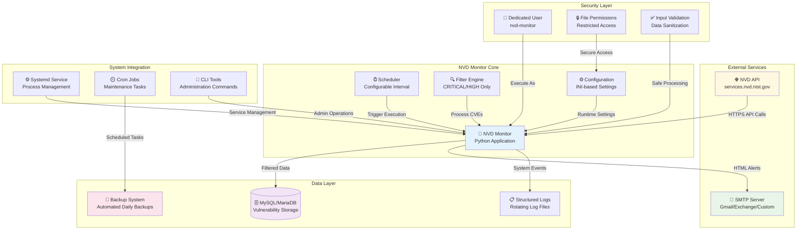
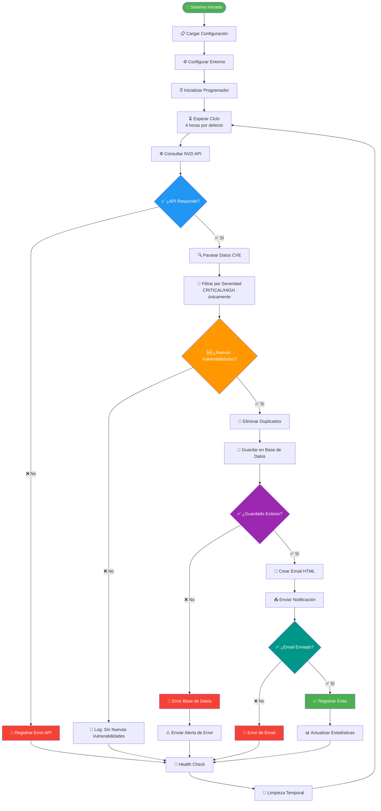
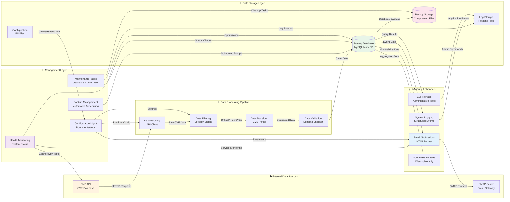

# 🛡️ NVD Vulnerability Monitor

[](https://opensource.org/licenses/MIT)
[](https://ubuntu.com/)
[](https://www.python.org/)
[](https://www.mysql.com/)
[](https://github.com/tu-usuario/nvd-monitor)

## 📋 Descripción

**NVD Vulnerability Monitor** es un sistema de monitoreo automatizado de vulnerabilidades críticas y de alto riesgo desde la **National Vulnerability Database (NVD)**. El sistema está específicamente diseñado para Ubuntu 24.04 LTS y proporciona detección en tiempo real de vulnerabilidades zero-day, almacenamiento persistente en base de datos, y notificaciones automáticas por correo electrónico.

### 🎯 Características Principales

- ✅ **Monitoreo Automático 24/7**: Consulta NVD API cada 4 horas (configurable)
- ✅ **Filtrado Inteligente**: Solo vulnerabilidades CRITICAL y HIGH
- ✅ **Zero-Day Detection**: Identifica vulnerabilidades recién publicadas
- ✅ **Base de Datos Persistente**: Almacenamiento en MySQL/MariaDB
- ✅ **Alertas HTML**: Notificaciones por email con formato profesional
- ✅ **Administración Completa**: Comandos CLI integrados
- ✅ **Backup Automático**: Respaldos programados con retención
- ✅ **Health Monitoring**: Verificación continua del sistema
- ✅ **Servicio Systemd**: Ejecución nativa del sistema

## 🏗️ Arquitectura del Sistema



## 📁 Estructura del Sistema de Archivos

```
/opt/nvd-monitor/                      # Aplicación principal
├── nvd_monitor.py                     # Script principal del monitor
├── configure.py                       # Script de configuración post-instalación
├── nvd_admin.py                       # Herramientas de administración
├── requirements.txt                   # Dependencias Python
├── venv/                             # Entorno virtual aislado
│   ├── bin/                          # Ejecutables Python
│   ├── lib/                          # Librerías instaladas
│   └── pyvenv.cfg                    # Configuración del entorno
└── README.md                         # Documentación local

/etc/nvd-monitor/                      # Configuración del sistema
├── config.ini                        # Configuración principal
└── config-backup-YYYYMMDD.ini       # Respaldos automáticos de configuración

/var/log/nvd-monitor/                  # Sistema de logging
├── nvd-monitor.log                    # Log principal de la aplicación
├── nvd-monitor.log.1.gz              # Logs rotados (comprimidos)
├── health-check.log                   # Logs de verificación de salud
├── backup.log                         # Logs de operaciones de backup
└── admin.log                          # Logs de comandos administrativos

/var/lib/nvd-monitor/                  # Datos y utilidades del sistema
├── scripts/                          # Scripts de mantenimiento
│   ├── backup.sh                     # Script de backup automatizado
│   ├── health-check.sh               # Verificación de salud del sistema
│   └── maintenance.sh                # Tareas de mantenimiento
├── backups/                          # Respaldos de base de datos
│   ├── nvd_monitor_backup_YYYYMMDD_HHMMSS.sql.gz
│   └── config_backup_YYYYMMDD.ini
├── reports/                          # Reportes generados automáticamente
│   ├── weekly-vulnerability-report-YYYYMMDD.txt
│   └── monthly-statistics-YYYYMM.txt
└── cache/                            # Cache temporal (uso futuro)

/usr/local/bin/                        # Comandos ejecutables globalmente
├── nvd-monitor                        # Comando principal del sistema
├── nvd-configure                      # Herramienta de configuración
├── nvd-admin                          # Comandos de administración
└── nvd-status                         # Estado rápido del sistema

/etc/systemd/system/                   # Integración con systemd
└── nvd-monitor.service               # Archivo de servicio del sistema

/etc/logrotate.d/                      # Configuración de rotación de logs
└── nvd-monitor                        # Reglas de rotación específicas
```

## 🚀 Instalación

### Prerrequisitos

| Componente | Versión Mínima | Notas |
|------------|----------------|-------|
| **Sistema Operativo** | Ubuntu 24.04 LTS | Única distribución soportada |
| **Python** | 3.10+ | Incluido en Ubuntu 24.04 |
| **MySQL/MariaDB** | MySQL 8.0+ / MariaDB 10.6+ | Base de datos para almacenamiento |
| **Acceso root/sudo** | Requerido | Para instalación del sistema |
| **Conexión a Internet** | Estable | Para consultas a NVD API |
| **API Key NVD** | Gratuita | [Obtener aquí](https://nvd.nist.gov/developers/request-an-api-key) |

### Proceso de Instalación

#### **Opción 1: Instalación Automatizada (Recomendada)**

```bash
# 1. Clonar el repositorio
git clone https://github.com/juanpadiaz/nvd-monitor.git
cd nvd-monitor

# 2. Ejecutar instalación completa
sudo bash install.sh

# 3. Configurar el sistema (se ejecuta automáticamente)
# Seguir las instrucciones interactivas
```

#### **Opción 2: Verificación Manual Paso a Paso**

```bash
# 1. Verificar prerrequisitos
lsb_release -a | grep "24.04"  # Ubuntu 24.04
python3 --version              # Python 3.10+
mysql --version                # MySQL/MariaDB

# 2. Clonar repositorio
git clone https://github.com/tu-usuario/nvd-monitor.git
cd nvd-monitor

# 3. Ejecutar instalación
sudo bash install.sh

# 4. Verificar instalación
nvd-admin test-all

# 5. Iniciar servicio
sudo systemctl enable --now nvd-monitor
```

### Post-Instalación

```bash
# Verificar estado del servicio
sudo systemctl status nvd-monitor

# Ver logs en tiempo real
sudo journalctl -u nvd-monitor -f

# Probar funcionalidad completa
nvd-admin test-all

# Ver últimas vulnerabilidades detectadas
nvd-admin show-vulns --limit 10
```

## 🔄 Diagrama Conceptual del Sistema



## 📊 Diagrama de Flujo de Datos



## ⚙️ Configuración

### Configuración Automática Post-Instalación

El sistema incluye un asistente de configuración interactivo que se ejecuta automáticamente después de la instalación:

```bash
# La configuración se ejecuta automáticamente, pero puede ejecutarse manualmente:
sudo nvd-configure
```

### Parámetros de Configuración

| Sección | Parámetro | Descripción | Valor por Defecto |
|---------|-----------|-------------|-------------------|
| **database** | host | Servidor de base de datos | localhost |
| **database** | port | Puerto de conexión | 3306 |
| **database** | database | Nombre de la base de datos | nvd_monitor |
| **database** | user | Usuario de la base de datos | nvd_user |
| **database** | password | Contraseña de la base de datos | (generada) |
| **nvd** | api_key | API Key de NVD | (usuario debe proporcionar) |
| **email** | smtp_server | Servidor SMTP | smtp.gmail.com |
| **email** | smtp_port | Puerto SMTP | 587 |
| **email** | sender_email | Email del remitente | (usuario debe proporcionar) |
| **email** | sender_password | Contraseña del remitente | (usuario debe proporcionar) |
| **email** | recipient_email | Email del destinatario | (usuario debe proporcionar) |
| **monitoring** | check_interval_hours | Intervalo de verificación | 4 |
| **logging** | level | Nivel de logging | INFO |
| **logging** | file | Archivo de log principal | /var/log/nvd-monitor/nvd-monitor.log |

## 🔧 Comandos de Administración

### Comandos Principales

```bash
# === VERIFICACIÓN Y ESTADO ===
nvd-monitor --test-db              # Probar conexión a base de datos
nvd-monitor --test-email           # Probar envío de email
nvd-monitor --test-nvd             # Probar conexión con NVD API
nvd-status                         # Estado rápido del sistema

# === EJECUCIÓN MANUAL ===
nvd-monitor --run-once             # Ejecutar verificación única
nvd-monitor --daemon               # Ejecutar como daemon (modo desarrollo)

# === ADMINISTRACIÓN AVANZADA ===
nvd-admin test-all                 # Probar todas las conexiones
nvd-admin show-vulns --limit 20    # Mostrar últimas 20 vulnerabilidades
nvd-admin show-vulns --severity CRITICAL  # Solo vulnerabilidades críticas
nvd-admin stats                    # Mostrar estadísticas del sistema
nvd-admin config                   # Mostrar configuración actual (sin contraseñas)
nvd-admin backup                   # Crear backup manual de la base de datos

# === CONFIGURACIÓN ===
nvd-configure                      # Reconfigurar sistema completo
nvd-admin update-config            # Actualizar configuración específica
```

### Gestión del Servicio

```bash
# === CONTROL DEL SERVICIO ===
sudo systemctl start nvd-monitor      # Iniciar servicio
sudo systemctl stop nvd-monitor       # Detener servicio
sudo systemctl restart nvd-monitor    # Reiniciar servicio
sudo systemctl status nvd-monitor     # Ver estado detallado
sudo systemctl enable nvd-monitor     # Habilitar inicio automático
sudo systemctl disable nvd-monitor    # Deshabilitar inicio automático

# === MONITOREO DE LOGS ===
sudo journalctl -u nvd-monitor -f         # Ver logs en tiempo real
sudo journalctl -u nvd-monitor -n 50      # Últimas 50 líneas de log
sudo journalctl -u nvd-monitor --since "1 hour ago"  # Logs de la última hora
sudo journalctl -u nvd-monitor --since today  # Logs de hoy

# === LOGS DE APLICACIÓN ===
tail -f /var/log/nvd-monitor/nvd-monitor.log      # Log principal
tail -f /var/log/nvd-monitor/health-check.log     # Logs de health checks
tail -f /var/log/nvd-monitor/backup.log           # Logs de backups
```

## 📧 Sistema de Notificaciones

### Formato de Alertas por Email

Las notificaciones incluyen:

- **📊 Resumen Ejecutivo**: Número total de vulnerabilidades detectadas
- **🎯 Detalles por CVE**: ID, puntuación CVSS, fecha de publicación
- **📝 Descripción Completa**: Descripción técnica de cada vulnerabilidad
- **🏢 Productos Afectados**: Lista de software y versiones vulnerables
- **🔗 Referencias Oficiales**: Enlaces a documentación y parches
- **🎨 Clasificación Visual**: Código de colores por nivel de severidad
- **⏰ Timestamp**: Fecha y hora de detección

### Ejemplo de Contenido de Email

```html
🚨 ALERTA DE VULNERABILIDADES CRÍTICAS
Reporte generado: 2025-07-16 14:30:15

Se han detectado 3 nuevas vulnerabilidades críticas:

🔴 CVE-2025-0001 - CVSS: 9.8 (CRITICAL)
📅 Publicado: 2025-07-16
📝 Buffer overflow in example-software v1.2.3
🏢 Afecta: example-software:1.2.3, related-tool:2.1.0
🔗 https://nvd.nist.gov/vuln/detail/CVE-2025-0001

[Detalles adicionales para cada CVE...]
```

## 📊 Monitoreo y Métricas

### Métricas Disponibles

```bash
# Estadísticas generales
nvd-admin stats

# Ejemplo de salida:
# 📊 ESTADÍSTICAS DEL SISTEMA
# ================================
# 🔍 Total vulnerabilidades: 1,247
# 🔴 Críticas: 89 (7.1%)
# 🟠 Altas: 158 (12.7%)
# 📈 Puntuación CVSS promedio: 8.2
# 
# 📅 Últimos 30 días:
#   2025-07: 45 vulnerabilidades
#   2025-06: 52 vulnerabilidades
# 
# 🎯 Productos más afectados:
#   1. linux_kernel (23 CVEs)
#   2. apache_http_server (18 CVEs)
#   3. mysql (15 CVEs)
```

### Health Checks Automatizados

El sistema incluye verificaciones automáticas cada 30 minutos:

- ✅ **Estado del Servicio**: Verificar que nvd-monitor esté ejecutándose
- ✅ **Conectividad de BD**: Probar conexión y latencia a MySQL/MariaDB
- ✅ **API de NVD**: Verificar disponibilidad y límites de rate
- ✅ **Configuración SMTP**: Probar autenticación y conectividad
- ✅ **Espacio en Disco**: Monitorear uso de almacenamiento
- ✅ **Memoria del Sistema**: Verificar uso de recursos
- ✅ **Actividad Reciente**: Confirmar operación normal

## 🛠️ Mantenimiento y Operaciones

### Tareas Automatizadas

| Tarea | Frecuencia | Descripción |
|-------|------------|-------------|
| **Backup de BD** | Diario 02:00 AM | Backup completo comprimido con retención de 30 días |
| **Health Check** | Cada 30 minutos | Verificación completa del estado del sistema |
| **Rotación de Logs** | Diario | Compresión y archivado de logs con retención de 30 días |
| **Limpieza de Cache** | Semanal | Eliminación de archivos temporales y cache obsoleto |
| **Reporte Semanal** | Lunes 09:00 AM | Generación automática de estadísticas semanales |
| **Actualización de BD** | Según necesidad | Mantenimiento automático de índices y optimización |

### Comandos de Mantenimiento

```bash
# === BACKUP Y RESTAURACIÓN ===
nvd-admin backup                           # Backup manual inmediato
nvd-admin backup --output /custom/path     # Backup en ubicación específica
nvd-admin restore --file backup.sql.gz    # Restaurar desde backup
ls /var/lib/nvd-monitor/backups/          # Listar backups disponibles

# === HEALTH CHECKS ===
nvd-admin health-check                     # Verificación manual completa
nvd-admin health-check --email-alerts     # Con alertas por email
/var/lib/nvd-monitor/scripts/health-check.sh  # Script directo

# === MANTENIMIENTO DE LOGS ===
nvd-admin cleanup-logs                     # Limpiar logs antiguos manualmente
sudo logrotate -f /etc/logrotate.d/nvd-monitor  # Forzar rotación
find /var/log/nvd-monitor -name "*.gz" -mtime +30 -delete  # Limpieza manual

# === OPTIMIZACIÓN ===
nvd-admin optimize-db                      # Optimizar base de datos
nvd-admin update-stats                     # Actualizar estadísticas internas
nvd-admin cleanup-temp                     # Limpiar archivos temporales
```

## 🔒 Seguridad y Mejores Prácticas

### Medidas de Seguridad Implementadas

- 🔐 **Usuario Dedicado**: Servicio ejecuta como usuario `nvd-monitor` sin privilegios elevados
- 🛡️ **Permisos Restrictivos**: Archivos de configuración con permisos 600 (solo owner)
- 🔑 **Configuración Segura**: Contraseñas nunca expuestas en logs o outputs
- 🌐 **Conexiones HTTPS**: Todas las comunicaciones externas son encriptadas
- ✅ **Validación de Entrada**: Sanitización de todos los datos recibidos de APIs
- 📝 **Auditoría Completa**: Logging detallado de todas las operaciones
- 🔄 **Rotación de Logs**: Prevención de acumulación excesiva de datos sensibles

### Configuración de Seguridad Recomendada

```bash
# Verificar permisos de archivos críticos
ls -la /etc/nvd-monitor/config.ini        # Debe ser 600 (rw-------)
ls -la /opt/nvd-monitor/                   # Debe pertenecer a nvd-monitor

# Verificar usuario del servicio
ps aux | grep nvd-monitor                  # Debe ejecutarse como nvd-monitor

# Verificar conexiones de red
netstat -tulpn | grep python               # Solo conexiones HTTPS salientes

# Auditar logs de acceso
sudo journalctl -u nvd-monitor | grep "ERROR\|WARN"  # Revisar eventos de seguridad
```

## 🐛 Solución de Problemas

### Problemas Comunes y Soluciones

<details>
<summary>🔴 <strong>Servicio no inicia</strong></summary>

```bash
# 1. Verificar logs del servicio
sudo journalctl -u nvd-monitor -n 50

# 2. Verificar configuración
nvd-admin config

# 3. Probar componentes individualmente
nvd-admin test-all

# 4. Verificar permisos
sudo chown -R nvd-monitor:nvd-monitor /opt/nvd-monitor
sudo chmod 600 /etc/nvd-monitor/config.ini

# 5. Reiniciar servicio
sudo systemctl restart nvd-monitor
```
</details>

<details>
<summary>🔶 <strong>Error de conexión a base de datos</strong></summary>

```bash
# 1. Probar conexión específica
nvd-admin test-db

# 2. Verificar que MySQL/MariaDB esté ejecutándose
sudo systemctl status mysql
sudo systemctl status mariadb

# 3. Verificar credenciales en configuración
nvd-admin config | grep -A 5 "database"

# 4. Probar conexión manual
mysql -h localhost -u nvd_user -p nvd_monitor

# 5. Recrear usuario y base de datos si es necesario
sudo nvd-configure --reset-database
```
</details>

<details>
<summary>🔵 <strong>Error de API de NVD</strong></summary>

```bash
# 1. Probar conectividad
nvd-admin test-nvd

# 2. Verificar API key
nvd-admin config | grep api_key

# 3. Verificar conectividad a internet
curl -I https://services.nvd.nist.gov/rest/json/cves/2.0

# 4. Verificar límites de rate
# Con API key: 120 requests/minuto
# Sin API key: 5 requests/30 segundos

# 5. Verificar logs de API
grep "NVD API" /var/log/nvd-monitor/nvd-monitor.log
```
</details>

<details>
<summary>🟡 <strong>Emails no se envían</strong></summary>

```bash
# 1. Probar configuración de email
nvd-admin test-email

# 2. Verificar configuración SMTP
nvd-admin config | grep -A 6 "email"

# 3. Para Gmail: verificar contraseña de aplicación
# Ir a: https://myaccount.google.com/apppasswords

# 4. Verificar conectividad SMTP
telnet smtp.gmail.com 587

# 5. Revisar logs de email
grep "email\|smtp" /var/log/nvd-monitor/nvd-monitor.log
```
</details>

### Logs de Diagnóstico

```bash
# === LOGS DEL SISTEMA ===
sudo journalctl -u nvd-monitor -f                    # Tiempo real
sudo journalctl -u nvd-monitor --since "1 hour ago" # Última hora
sudo journalctl -u nvd-monitor --priority=err        # Solo errores

# === LOGS DE APLICACIÓN ===
tail -f /var/log/nvd-monitor/nvd-monitor.log         # Log principal
tail -f /var/log/nvd-monitor/health-check.log        # Health checks
tail -f /var/log/nvd-monitor/backup.log              # Operaciones de backup

# === ACTIVAR MODO DEBUG ===
sudo sed -i 's/level = INFO/level = DEBUG/' /etc/nvd-monitor/config.ini
sudo systemctl restart nvd-monitor
# Ver logs detallados, luego revertir:
sudo sed -i 's
```
### Información de Contacto

- Desarrollador: Juan Pablo Díaz Ezcurdia [jpdiaz.com](https://jpdiaz.com/)
- Versión: 1.0.0
- Licencia: LGPL-2.1 license
- Última actualización: Julio 2025

Nota: Este sistema está diseñado para complementar, no reemplazar, las herramientas de seguridad existentes. Siempre valide los resultados y mantenga actualizadas las fuentes de threat intelligence.

