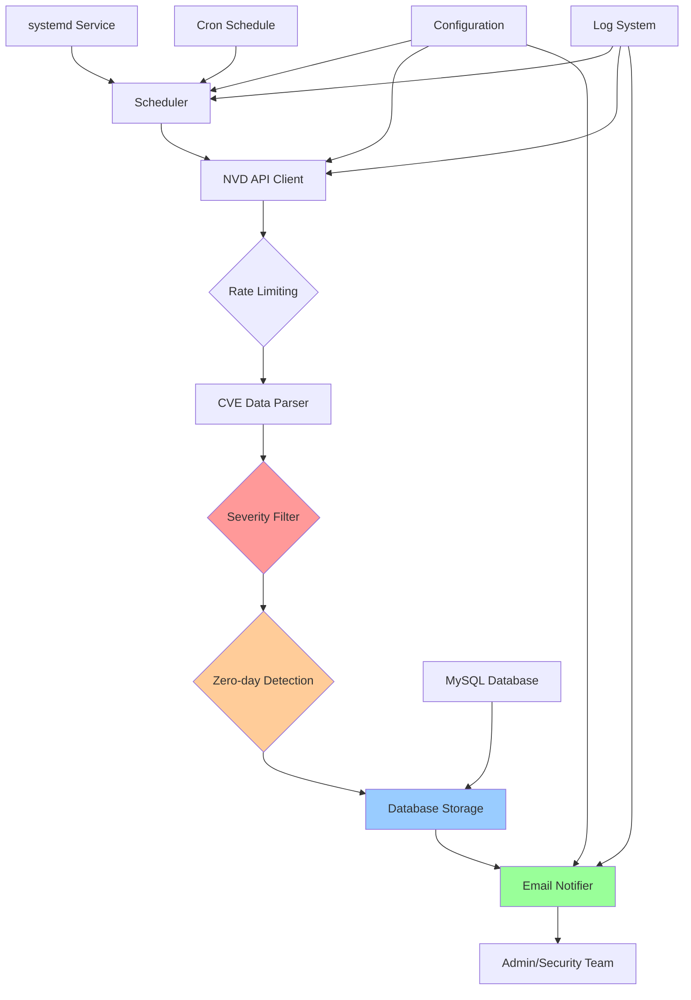
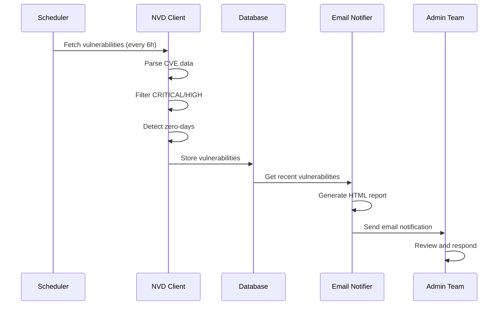

# NVD Monitor - Sistema de Monitoreo de Vulnerabilidades

## Descripción

NVD Monitor es una aplicación desarrollada para Ubuntu 22.04 que consulta la National Vulnerability Database (NVD) de NIST para identificar y notificar vulnerabilidades críticas, incluyendo zero-days, vulnerabilidades críticas y de alto impacto.

## Características

- ✅ **Monitoreo automatizado** de las publicaciones de la National Vulnerability Database cada 6 horas (configurable)
- ✅ **Filtrado inteligente** de vulnerabilidades críticas (CRITICAL/HIGH)
- ✅ **Detección de zero-days** y exploits disponibles
- ✅ **Almacenamiento en MySQL** con historial completo
- ✅ **Notificaciones por email** con reportes detallados
- ✅ **Servicio systemd** para ejecución continua
- ✅ **Logging completo** con rotación automática
- ✅ **API Key opcional** para mayor rendimiento

## Arquitectura del Sistema

```
┌─────────────────────────────────────────────────────────────────┐
│                    NVD Monitor Architecture                     │
├─────────────────────────────────────────────────────────────────┤
│                                                                 │
│  ┌─────────────┐    ┌─────────────┐    ┌─────────────┐          │
│  │   Scheduler │    │ NVD Client  │    │   Database  │          │
│  │             │    │             │    │   Manager   │          │
│  │ ┌─────────┐ │    │ ┌─────────┐ │    │ ┌─────────┐ │          │
│  │ │ Cron    │ │ ─▶│ │ API     │  │ ─▶│ │ MySQL   │ │          │
│  │ │ 6 hours │ │    │ │ Client  │ │    │ │ Storage │ │          │
│  │ └─────────┘ │    │ └─────────┘ │    │ └─────────┘ │          │
│  └─────────────┘    └─────────────┘    └─────────────┘          │
│                                                                 │
│  ┌─────────────┐    ┌─────────────┐    ┌─────────────┐          │
│  │   Filter    │    │  Analyzer   │    │   Notifier  │          │
│  │             │    │             │    │             │          │
│  │ ┌─────────┐ │    │ ┌─────────┐ │    │ ┌─────────┐ │          │
│  │ │Critical │ │ ─▶│ │Zero-day │ │  ─▶│ │  Email  │ │          │
│  │ │High Sev │ │    │ │Detector │ │    │ │Reporter │ │          │
│  │ └─────────┘ │    │ └─────────┘ │    │ └─────────┘ │          │
│  └─────────────┘    └─────────────┘    └─────────────┘          │
│                                                                 │
└─────────────────────────────────────────────────────────────────┘
```

## Sistema de Archivos

```
/opt/nvd_monitor/
├── bin/
│   └── nvd_monitor.py          # Aplicación principal
├── venv/                       # Entorno virtual Python
├── logs/                       # Logs locales
└── setup_config.sh            # Script de configuración

/etc/nvd_monitor/
└── config.ini                 # Configuración principal

/var/log/nvd_monitor/
├── nvd_monitor.log            # Log principal
├── nvd_monitor.log.1.gz       # Logs rotados
└── ...

/etc/systemd/system/
└── nvd-monitor.service        # Servicio systemd

/usr/local/bin/
└── nvd-monitor               # Script de utilidad
```

## Instalación

### Requisitos del Sistema

- Ubuntu 22.04 LTS
- Python 3.10+
- MySQL 8.0+
- Acceso a internet
- Permisos de root

### Instalación Automática

```bash
# Descargar e instalar
wget -O install.sh https://raw.githubusercontent.com/company/nvd-monitor/main/install.sh
chmod +x install.sh
sudo ./install.sh
```

### Instalación Manual

```bash
# 1. Clonar repositorio
git clone https://github.com/company/nvd-monitor.git
cd nvd-monitor

# 2. Ejecutar instalador
sudo ./install.sh

# 3. Configurar aplicación
sudo /opt/nvd_monitor/setup_config.sh

# 4. Copiar código fuente
sudo cp nvd_monitor.py /opt/nvd_monitor/bin/

# 5. Iniciar servicio
sudo systemctl start nvd-monitor
```

## Configuración

### Archivo de Configuración

El archivo principal de configuración se encuentra en `/etc/nvd_monitor/config.ini`:

```ini
[database]
host = localhost
port = 3306
database = nvd_monitor
user = nvd_user
password = secure_password

[nvd]
# API Key opcional para mayor rendimiento
api_key = your_nvd_api_key_here

[email]
smtp_server = smtp.gmail.com
smtp_port = 587
username = alerts@company.com
password = app_password
from_email = alerts@company.com
to_emails = admin@company.com,security@company.com

[monitor]
check_interval = 6  # Horas entre verificaciones
```

### Configuración de Email

Para Gmail:
1. Habilitar autenticación de 2 factores
2. Generar contraseña de aplicación
3. Usar la contraseña de aplicación en el config

### API Key de NVD

Para obtener mayor rendimiento (5000 requests/minuto vs 50):
1. Registrarse en: https://nvd.nist.gov/developers/request-an-api-key
2. Agregar el API key al archivo de configuración

## Uso

### Comandos de Administración

```bash
# Iniciar servicio
nvd-monitor start

# Detener servicio
nvd-monitor stop

# Reiniciar servicio
nvd-monitor restart

# Ver estado
nvd-monitor status

# Ver logs en tiempo real
nvd-monitor logs

# Ejecutar verificación manual
nvd-monitor check

# Editar configuración
nvd-monitor config
```

### Logs

Los logs se almacenan en `/var/log/nvd_monitor/nvd_monitor.log`:

```bash
# Ver logs recientes
tail -f /var/log/nvd_monitor/nvd_monitor.log

# Ver logs de systemd
journalctl -u nvd-monitor -f

# Ver logs de una fecha específica
journalctl -u nvd-monitor --since "2025-01-01" --until "2025-01-02"
```

## Base de Datos

### Estructura de la Tabla

```sql
CREATE TABLE vulnerabilities (
    id INT AUTO_INCREMENT PRIMARY KEY,
    cve_id VARCHAR(20) UNIQUE NOT NULL,
    description TEXT,
    severity VARCHAR(20),
    base_score DECIMAL(3,1),
    vector_string TEXT,
    published_date DATETIME,
    last_modified DATETIME,
    references TEXT,
    cwe_id VARCHAR(20),
    exploit_code BOOLEAN DEFAULT FALSE,
    created_at TIMESTAMP DEFAULT CURRENT_TIMESTAMP,
    updated_at TIMESTAMP DEFAULT CURRENT_TIMESTAMP ON UPDATE CURRENT_TIMESTAMP
);
```

### Consultas Útiles

```sql
-- Vulnerabilidades críticas recientes
SELECT * FROM vulnerabilities 
WHERE severity = 'CRITICAL' 
AND created_at >= NOW() - INTERVAL 24 HOUR;

-- Zero-days detectados
SELECT * FROM vulnerabilities 
WHERE exploit_code = TRUE 
ORDER BY published_date DESC;

-- Estadísticas por severidad
SELECT severity, COUNT(*) as count 
FROM vulnerabilities 
GROUP BY severity;
```

## Notificaciones por Email

### Formato del Reporte

Las notificaciones incluyen:
- **Resumen ejecutivo** con estadísticas
- **Vulnerabilidades críticas** ordenadas por score
- **Indicadores de zero-day** y exploits
- **Enlaces a referencias** y documentación
- **Información de CWE** cuando disponible

### Ejemplo de Notificación

```
🚨 Reporte de Vulnerabilidades Críticas - 2025-07-15 14:30

Resumen:
• Total de vulnerabilidades: 15
• Críticas: 3
• Altas: 12
• Con exploit: 2

CVE-2025-1234 - CRITICAL (9.8)
🔓 EXPLOIT DISPONIBLE
Descripción: Buffer overflow en componente X...
Fecha: 2025-07-15 12:00:00
```

## Monitoreo y Alertas

### Métricas del Sistema

```bash
# Verificar estado del servicio
systemctl status nvd-monitor

# Uso de recursos
htop -p $(pgrep -f nvd_monitor)

# Espacio en disco
df -h /var/log/nvd_monitor/

# Conexiones MySQL
mysql -e "SHOW PROCESSLIST;"
```

### Troubleshooting

#### Problemas Comunes

1. **Servicio no inicia**
   ```bash
   # Verificar logs
   journalctl -u nvd-monitor --no-pager
   
   # Verificar configuración
   python3 -c "import configparser; c=configparser.ConfigParser(); c.read('/etc/nvd_monitor/config.ini'); print('Config OK')"
   ```

2. **No se reciben emails**
   ```bash
   # Probar configuración SMTP
   python3 -c "
   import smtplib
   server = smtplib.SMTP('smtp.gmail.com', 587)
   server.starttls()
   server.login('user', 'pass')
   print('SMTP OK')
   "
   ```

3. **Error de base de datos**
   ```bash
   # Verificar conexión MySQL
   mysql -u nvd_user -p -h localhost nvd_monitor -e "SELECT 1;"
   
   # Verificar tablas
   mysql -u nvd_user -p nvd_monitor -e "DESCRIBE vulnerabilities;"
   ```

## Diagrama Conceptual del Sistema



## Flujo de Datos



## Seguridad

### Medidas Implementadas

- **Usuario no privilegiado** (nvd_monitor)
- **Configuración protegida** (chmod 600)
- **Validación de datos** de entrada
- **Logging de seguridad** completo
- **Límites de recursos** systemd
- **Sandboxing** con systemd

### Recomendaciones

1. **Cambiar contraseñas** por defecto
2. **Usar API keys** para NVD
3. **Configurar firewall** apropiadamente
4. **Monitorear logs** regularmente
5. **Actualizar sistema** periódicamente

## Desarrollo

### Estructura del Código

```python
# Clases principales
class VulnerabilityMonitor    # Coordinador principal
class NVDClient              # Cliente API NVD
class DatabaseManager        # Gestor MySQL
class EmailNotifier         # Notificador email
class Vulnerability         # Modelo de datos
```

### Testing

```bash
# Ejecutar tests
cd /opt/nvd_monitor
source venv/bin/activate
python -m pytest tests/

# Test de integración
nvd-monitor check
```

### Contribuciones

1. Fork del repositorio
2. Crear feature branch
3. Commit changes
4. Push to branch
5. Create Pull Request


## Changelog

### v1.0.0 (2025-07-15)
- Implementación inicial
- Monitoreo NVD automático
- Notificaciones por email
- Almacenamiento MySQL
- Servicio systemd
- Detección zero-day básica

---

### Contribuciones
- Para contribuir al proyecto: [github](https://github.com/juanpadiaz/NVD-Monitor) 

### Soporte
- **Issues**: https://github.com/juanpadiaz/NVD-Monitor/issues
- **Wiki**: https://github.com/juanpadiaz/NVD-Monitor/wiki

### Información de Contacto
- Desarrollador: Juan Pablo Díaz Ezcurdia [jpdiaz.com](https://jpdiaz.com/)
- Versión: 1.0.0
- Licencia: LGPL-3.0 license
- Última actualización: Julio 2025

Es importante recordar que las vulnerabilidades zero-day, por definición, son desconocidas hasta que se descubren y divulgan, por lo que la información pública aparece después del descubrimiento inicial.

Nota: Este sistema está diseñado para complementar, no reemplazar, las herramientas de seguridad existentes. Siempre valide los resultados y mantenga actualizadas las fuentes de threat intelligence.
