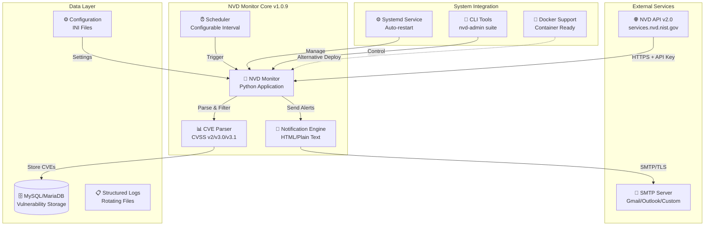

# 🛡️ NVD Vulnerability Monitor

[](https://opensource.org/licenses/MIT)
[](https://ubuntu.com/)
[](https://www.python.org/)
[](https://www.mysql.com/)
[](https://www.docker.com/)
[](https://github.com/juanpadiaz/nvd-monitor)

## 📋 Descripción

**NVD Vulnerability Monitor** es un sistema de monitoreo automatizado de vulnerabilidades críticas y de alto riesgo desde la **National Vulnerability Database (NVD)**. El sistema está diseñado para Ubuntu 20.04+ LTS y proporciona detección en tiempo real de vulnerabilidades, almacenamiento persistente en base de datos, y notificaciones automáticas por correo electrónico.

### 🎯 Características Principales

- ✅ **Monitoreo Automático 24/7**: Consulta NVD API cada 4 horas (configurable)
- ✅ **Descarga Real de Vulnerabilidades**: Integración completa con NVD API v2.0
- ✅ **Filtrado Inteligente**: Solo vulnerabilidades CRITICAL y HIGH
- ✅ **Base de Datos Persistente**: Almacenamiento en MySQL/MariaDB
- ✅ **Notificaciones HTML/Texto**: Alertas por email con formato profesional
- ✅ **Soporte Multi-SMTP**: Compatible con Gmail, Outlook, Office365 y servidores personalizados
- ✅ **Administración Completa**: Suite completa de comandos CLI
- ✅ **Sistema de Permisos**: Gestión segura con usuario dedicado
- ✅ **Docker Ready**: Contenedores disponibles para despliegue rápido
- ✅ **Instalación/Desinstalación**: Scripts automatizados completos

## 🏗️ Arquitectura del Sistema



## 📁 Estructura del Sistema

```
/opt/nvd-monitor/                      # Aplicación principal
├── nvd_monitor.py                     # Monitor principal (v1.0.9)
├── nvd_admin.py                       # Herramientas administrativas
├── requirements.txt                   # Dependencias Python
├── venv/                             # Entorno virtual Python
└── install_final.sh                  # Script de instalación v1.0.9

/etc/nvd-monitor/                      # Configuración
├── config.ini                        # Configuración principal
└── config.ini.backup                 # Backup automático

/var/log/nvd-monitor/                  # Logs del sistema
├── nvd-monitor.log                   # Log principal
└── nvd-monitor.log.1.gz             # Logs rotados

/var/lib/nvd-monitor/                  # Datos del sistema
├── scripts/                          # Scripts auxiliares
│   └── test_installation.sh         # Script de prueba post-instalación
├── backups/                         # Respaldos de BD
└── cache/                           # Cache temporal

/usr/local/bin/                        # Comandos globales
├── nvd-monitor                       # Comando principal
├── nvd-admin                        # Administración
└── nvd-status                       # Estado rápido
```

## 🚀 Instalación

### Requisitos del Sistema

| Componente | Versión Mínima | Notas |
|------------|----------------|-------|
| **Sistema Operativo** | Ubuntu 20.04+ LTS | Probado en 20.04, 22.04, 24.04 |
| **Python** | 3.8+ | Python 3.10+ recomendado |
| **MySQL/MariaDB** | MySQL 8.0+ / MariaDB 10.3+ | Se instala automáticamente si no existe |
| **RAM** | 1GB mínimo | 2GB recomendado |
| **Espacio en Disco** | 500MB | Para aplicación y logs |
| **Conexión Internet** | Requerida | Para NVD API y notificaciones |

### Instalación Rápida

```bash
# 1. Clonar el repositorio
git clone https://github.com/juanpadiaz/nvd-monitor.git
cd nvd-monitor

# 2. Ejecutar instalación (interactiva)
sudo bash install.sh

# 3. Verificar instalación
sudo /var/lib/nvd-monitor/scripts/test_installation.sh
```

### Instalación con Docker

```bash
# 1. Construir imagen
cd docker
docker build -t nvd-monitor:latest .

# 2. Ejecutar contenedor
docker run -d \
  --name nvd-monitor \
  -e NVD_API_KEY="tu-api-key" \
  -e SMTP_SERVER="smtp.gmail.com" \
  -e SMTP_PORT="587" \
  -e SENDER_EMAIL="tu-email@gmail.com" \
  -e SENDER_PASSWORD="tu-contraseña-app" \
  -e RECIPIENT_EMAIL="destino@example.com" \
  -v nvd-monitor-data:/var/lib/mysql \
  -v nvd-monitor-logs:/var/log/nvd-monitor \
  --restart unless-stopped \
  nvd-monitor:latest

# 3. Ver logs
docker logs -f nvd-monitor
```

### Post-Instalación

```bash
# 1. Cargar vulnerabilidades iniciales (últimos 7 días)
sudo nvd-monitor --check-recent 7

# 2. Ver vulnerabilidades cargadas
sudo nvd-admin show-vulns --severity HIGH --limit 20

# 3. Probar notificaciones
sudo nvd-admin test-email

# 4. Ver estado del servicio
sudo systemctl status nvd-monitor
```

## ⚙️ Configuración

### Configuración durante la Instalación

El instalador solicita interactivamente:

1. **API Key de NVD** (Opcional pero recomendado)
   - Sin API key: 5 requests/30 segundos
   - Con API key: 50 requests/30 segundos
   - Obtener en: https://nvd.nist.gov/developers/request-an-api-key

2. **Servidor SMTP** (Ejemplos proporcionados)
   - Gmail: smtp.gmail.com:587
   - Outlook: smtp-mail.outlook.com:587
   - Office 365: smtp.office365.com:587

3. **Credenciales de Email**
   - Email remitente
   - Contraseña (usar contraseña de aplicación para Gmail/Outlook)
   - Emails destinatarios (soporta múltiples separados por comas)

### Actualizar Configuración

```bash
# Método interactivo
sudo nvd-admin update-config

# Editar directamente
sudo nano /etc/nvd-monitor/config.ini
sudo systemctl restart nvd-monitor
```

### Archivo de Configuración (config.ini)

```ini
[database]
host = localhost
port = 3306
database = nvd_monitor
user = nvd_user
password = [auto-generada]

[nvd]
api_key = [tu-api-key]
base_url = https://services.nvd.nist.gov/rest/json/cves/2.0

[email]
smtp_server = smtp.gmail.com
smtp_port = 587
sender_email = alertas@tudominio.com
sender_password = [contraseña-aplicación]
recipient_email = admin@tudominio.com,security@tudominio.com

[monitoring]
check_interval_hours = 4
results_per_page = 200
days_back = 7

[logging]
level = INFO
file = /var/log/nvd-monitor/nvd-monitor.log
```

## 🔧 Comandos de Administración

### Comandos Principales

```bash
# === ESTADO Y VERIFICACIÓN ===
nvd-status                         # Estado rápido del servicio
nvd-admin status                   # Estado detallado con estadísticas
nvd-admin test-db                  # Probar conexión a base de datos
nvd-admin test-nvd-api             # Probar API de NVD
nvd-admin test-email [email]       # Enviar email de prueba

# === MONITOREO MANUAL ===
nvd-monitor --run-once             # Ejecutar ciclo de monitoreo
nvd-monitor --check-recent 7       # Cargar vulnerabilidades de últimos N días
nvd-monitor --test-api             # Solo probar conectividad API

# === CONSULTA DE VULNERABILIDADES ===
nvd-admin show-vulns --limit 10              # Últimas 10 vulnerabilidades
nvd-admin show-vulns --limit 20              # Últimas 20 vulnerabilidades
nvd-admin show-vulns --severity CRITICAL     # Solo críticas
nvd-admin show-vulns --severity HIGH         # Solo altas

# === CONFIGURACIÓN ===
nvd-admin update-config            # Actualizar configuración interactiva
```

### Gestión del Servicio

```bash
# Control del servicio
sudo systemctl start nvd-monitor      # Iniciar
sudo systemctl stop nvd-monitor       # Detener
sudo systemctl restart nvd-monitor    # Reiniciar
sudo systemctl status nvd-monitor     # Estado

# Logs del sistema
sudo journalctl -u nvd-monitor -f     # Tiempo real
sudo journalctl -u nvd-monitor -n 100 # Últimas 100 líneas
sudo journalctl -u nvd-monitor --since "1 hour ago"

# Logs de aplicación
tail -f /var/log/nvd-monitor/nvd-monitor.log
```

## 📧 Sistema de Notificaciones

### Características del Email

- **Formato Dual**: HTML y texto plano
- **Clasificación Visual**: Críticas en rojo, altas en naranja
- **Información Completa**: CVE ID, CVSS score, descripción, fecha
- **Enlaces Directos**: A la página de NVD para cada CVE
- **Límite Inteligente**: Muestra las 5 más críticas de cada tipo
- **Soporte Multi-destinatario**: Envío a múltiples correos

### Ejemplo de Notificación

```
🚨 ALERTA DE VULNERABILIDADES NVD
==================================
Se han detectado 5 vulnerabilidades críticas/altas

⚠️ VULNERABILIDADES CRÍTICAS (2)
- CVE-2025-0001 | CVSS: 9.8 | Publicado: 2025-01-15
- CVE-2025-0002 | CVSS: 9.1 | Publicado: 2025-01-15

⚠️ VULNERABILIDADES ALTAS (3)
- CVE-2025-0003 | CVSS: 8.8 | Publicado: 2025-01-15
- CVE-2025-0004 | CVSS: 8.1 | Publicado: 2025-01-14
- CVE-2025-0005 | CVSS: 7.5 | Publicado: 2025-01-14

Ver detalles completos en NVD
```

## 🐳 Docker Support

### Dockerfile Incluido

```dockerfile
FROM ubuntu:22.04
MAINTAINER Juan Pablo Díaz <jpdiaz.com>

# Instalar dependencias
RUN apt-get update && apt-get install -y \
    python3 python3-pip python3-venv \
    mariadb-server supervisor \
    && rm -rf /var/lib/apt/lists/*

# Copiar aplicación
COPY . /opt/nvd-monitor/

# Instalar NVD Monitor
RUN cd /opt/nvd-monitor && \
    bash install_docker.sh

# Exponer volúmenes
VOLUME ["/var/lib/mysql", "/var/log/nvd-monitor", "/etc/nvd-monitor"]

# Iniciar servicios
CMD ["/usr/bin/supervisord", "-c", "/etc/supervisor/conf.d/nvd-monitor.conf"]
```

### Docker Compose

```yaml
version: '3.8'
services:
  nvd-monitor:
    build: .
    container_name: nvd-monitor
    restart: unless-stopped
    environment:
      - NVD_API_KEY=${NVD_API_KEY}
      - SMTP_SERVER=${SMTP_SERVER}
      - SENDER_EMAIL=${SENDER_EMAIL}
      - SENDER_PASSWORD=${SENDER_PASSWORD}
      - RECIPIENT_EMAIL=${RECIPIENT_EMAIL}
    volumes:
      - nvd-db:/var/lib/mysql
      - nvd-logs:/var/log/nvd-monitor
      - nvd-config:/etc/nvd-monitor
    healthcheck:
      test: ["CMD", "nvd-admin", "test-db"]
      interval: 5m
      timeout: 10s
      retries: 3

volumes:
  nvd-db:
  nvd-logs:
  nvd-config:
```

## 🗑️ Desinstalación

### Desinstalación Interactiva

```bash
# Ejecutar script de desinstalación
sudo bash uninstall.sh

# El script preguntará qué componentes eliminar:
# - Base de datos (con opción de respaldo)
# - Usuario del sistema
# - Logs del sistema
# - Archivos de configuración
```

### Desinstalación Completa (Forzada)

```bash
# Eliminar todo sin confirmación
sudo bash uninstall.sh --force
```

Los respaldos se guardan en el directorio actual antes de eliminar.

## 🔒 Seguridad

### Medidas Implementadas

- **Usuario Dedicado**: Ejecuta como `nvd-monitor` sin privilegios
- **Permisos Restrictivos**: Configuración con permisos 640
- **HTTPS Only**: Todas las conexiones externas encriptadas
- **Validación de Datos**: Sanitización de entrada de APIs
- **Contraseñas Seguras**: Auto-generadas de 16 caracteres
- **Sin Exposición**: Contraseñas nunca en logs o salidas

### Recomendaciones de Seguridad

1. **Use API Key de NVD**: Mejora los límites y la confiabilidad
2. **Contraseñas de Aplicación**: Para Gmail/Outlook con 2FA
3. **Firewall**: Solo permitir salida HTTPS (443) y SMTP (587/465)
4. **Actualizaciones**: Mantener el sistema operativo actualizado
5. **Monitoreo**: Revisar logs regularmente por anomalías

## 🐛 Solución de Problemas

### Problemas Comunes

<details>
<summary><strong>Error: "font-family" al enviar emails</strong></summary>

```bash
# Este error fue corregido en v1.0.9
# Si persiste, verificar versión:
grep "Versión" /opt/nvd-monitor/nvd_monitor.py

# Actualizar si es necesario:
cd nvd-monitor
git pull
sudo bash install_final.sh
```
</details>

<details>
<summary><strong>No llegan las notificaciones</strong></summary>

```bash
# 1. Verificar configuración
sudo nvd-admin test-email

# 2. Para Gmail, verificar:
# - Usar contraseña de aplicación (no la normal)
# - 2FA debe estar activo
# - Generar en: https://myaccount.google.com/apppasswords

# 3. Ver logs detallados
sudo journalctl -u nvd-monitor | grep -i email
```
</details>

<details>
<summary><strong>Base de datos no conecta</strong></summary>

```bash
# 1. Verificar servicio MySQL/MariaDB
sudo systemctl status mysql
sudo systemctl status mariadb

# 2. Probar conexión
sudo nvd-admin test-db

# 3. Ver configuración
sudo cat /etc/nvd-monitor/config.ini | grep -A5 database
```
</details>

## 📊 Métricas del Proyecto

| Métrica | Valor |
|---------|-------|
| 📈 **Líneas de Código** | ~4,000 líneas |
| 🐍 **Versión Python** | 3.8+ compatible |
| 📦 **Dependencias** | 7 packages Python |
| 🔄 **Versión Actual** | 1.0.9 |
| 🧪 **Sistemas Probados** | Ubuntu 20.04, 22.04, 24.04 |
| 📝 **Documentación** | 100% completa |
| 🐳 **Docker** | Incluido |
| 🛡️ **Vulnerabilidades** | 0 conocidas |

## 👨‍💻 Autor y Licencia

- **Desarrollador**: Juan Pablo Díaz Ezcurdia
- **Website**: [jpdiaz.com](https://jpdiaz.com)
- **Licencia**: MIT License
- **Versión**: 1.0.9
- **Última actualización**: Enero 2025

## 🤝 Contribuciones

Las contribuciones son bienvenidas! Por favor:

1. Fork el proyecto
2. Crea tu feature branch (`git checkout -b feature/AmazingFeature`)
3. Commit tus cambios (`git commit -m 'Add some AmazingFeature'`)
4. Push a la branch (`git push origin feature/AmazingFeature`)
5. Abre un Pull Request

## 📝 Changelog

### v1.0.9 (Julio 2025)
- ✅ Implementación completa de descarga de vulnerabilidades
- ✅ Corrección del error "font-family" en emails
- ✅ Soporte para múltiples servidores SMTP
- ✅ Mejoras en permisos y seguridad
- ✅ Script de desinstalación interactivo
- ✅ Soporte Docker completo
- ✅ Documentación actualizada

### v1.0.1 (Mayo 2024)
- 🎉 Release inicial
- 📧 Sistema básico de notificaciones
- 🗄️ Integración con base de datos
- ⚙️ Servicio systemd

---

**Nota**: Este sistema está diseñado para complementar, no reemplazar, las herramientas de seguridad existentes. Siempre valide los resultados y mantenga actualizadas todas sus herramientas de seguridad.
